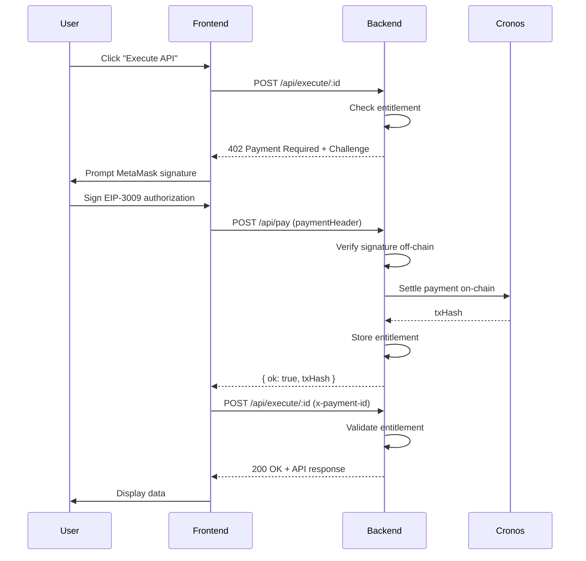
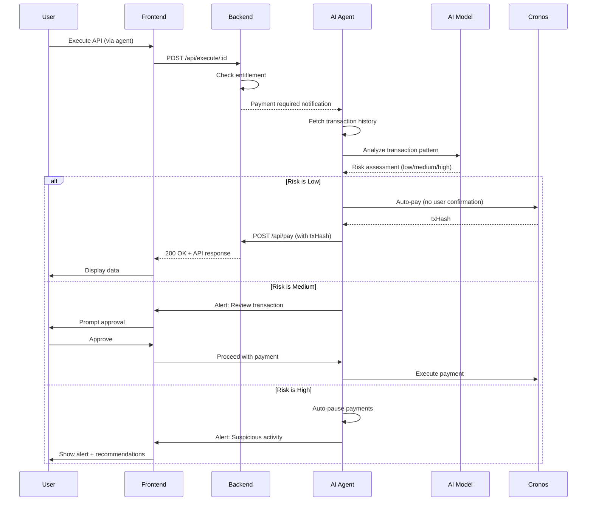

# 402Routes - Technical Documentation

## Overview

402Routes is an MVP implementation of a RapidAPI-like marketplace that uses X402 payment protocol instead of traditional API keys. It demonstrates how blockchain-based payments can replace subscription models with pay-per-use micropayments.

## Architecture

### High-Level Flow

```
┌─────────────────────┐         ┌──────────────────────┐
│                     │         │                      │
│  Frontend (Next.js) │  HTTP   │  Backend (Express)   │
│                     │────────▶│                      │
│  • Marketplace UI   │         │  • API CRUD          │
│  • Wallet Connect   │         │  • X402 Middleware   │
│  • X402 Flow Hook   │         │  • Payment Handler   │
│                     │         │                      │
└─────────────────────┘         └──────────────────────┘
         │                                 │
         │                                 │
         │        ┌────────────────────────┴──────────────┐
         │        │                                        │
         │        │ Verification & Settlement              │
         │        ▼                                        │
         │  ┌──────────────────────┐            ┌─────────▼────────┐
         │  │                      │            │                  │
         └─▶│  Cronos Blockchain   │◀───────────│  AI Agent        │
            │  + Facilitator       │   Monitor  │  (FastAPI)       │
            │                      │            │  • Auto Payment  │
            └──────────────────────┘            │  • Monitoring    │
                                                │  • Anomaly AI    │
                                                └──────────────────┘
```

## Backend Architecture

### Directory Structure

```
backend/
├── src/
│   ├── index.ts                    # Express app entry point
│   ├── types/
│   │   └── index.ts                # TypeScript interfaces
│   ├── middlewares/
│   │   └── x402.middleware.ts      # X402 payment enforcement
│   ├── services/
│   │   └── marketplace.service.ts  # Business logic
│   ├── controllers/
│   │   └── marketplace.controller.ts # Route handlers
│   └── routes/
│       ├── index.ts                # Route registration
│       └── marketplace.routes.ts   # API endpoints
├── package.json
└── tsconfig.json
```

### Key Components

#### 1. X402 Middleware (`middlewares/x402.middleware.ts`)

Based on `demo/paywall/resource-service/src/lib/middlewares/require.middleware.ts`

**Purpose**: Enforce payment before granting access to protected endpoints.

**Flow**:
1. Check if request has `x-payment-id` header
2. If valid entitlement exists, allow access
3. Otherwise, generate X402 challenge and respond with 402

```typescript
export const requireX402Payment = (options: RequireX402Options) => {
  return (req: Request, res: Response, next: NextFunction): void => {
    const entitlementKey = req.header('x-payment-id') ?? '';
    
    if (entitlementKey && paid.get(entitlementKey)?.settled) {
      next(); // Access granted
      return;
    }
    
    // Generate 402 challenge
    const paymentId = newPaymentId();
    res.status(402).json({
      x402Version: 1,
      error: 'payment_required',
      accepts: [{ /* payment requirements */ }]
    });
  };
};
```

#### 2. Payment Handler (`middlewares/x402.middleware.ts`)

**Purpose**: Verify and settle X402 payments.

**Flow**:
1. Verify payment signature off-chain (fast, no gas)
2. Settle payment on-chain via Facilitator
3. Record entitlement in memory

```typescript
export async function handleX402Payment(params) {
  // Verify signature
  const verify = await facilitator.verifyPayment(body);
  if (!verify.isValid) return { ok: false };
  
  // Settle on-chain
  const settle = await facilitator.settlePayment(body);
  if (settle.event !== 'payment.settled') return { ok: false };
  
  // Store entitlement
  paid.set(paymentId, { settled: true, txHash: settle.txHash });
  return { ok: true, txHash: settle.txHash };
}
```

#### 3. Marketplace Service (`services/marketplace.service.ts`)

**Purpose**: Manage API listings and execute API calls.

**Features**:
- CRUD operations for API listings
- In-memory storage (Map<string, ApiListing>)
- Mock API execution (returns dummy data)
- Payment settlement delegation

**Production Notes**:
- Replace Map with database (PostgreSQL, MongoDB)
- Implement real API proxying
- Add API key validation for owners
- Rate limiting per wallet/API

#### 4. Routes (`routes/marketplace.routes.ts`)

**Public Routes** (no payment):
- `GET /api/marketplace` - List APIs
- `GET /api/marketplace/:id` - Get API details
- `POST /api/marketplace` - Create API
- `PUT /api/marketplace/:id` - Update API
- `DELETE /api/marketplace/:id` - Delete API
- `POST /api/pay` - Settle payment

**Protected Routes** (require X402):
- `POST /api/execute/:id` - Execute API (payment required)

## AI Agent Architecture

### Directory Structure

```
agent/
├── app/
│   ├── __init__.py             # App initialization
│   ├── main.py                 # FastAPI entry point
│   ├── config.py               # Configuration
│   ├── database.py             # SQLite database
│   ├── schemas.py              # Pydantic models
│   ├── agent_wallet.py         # Autonomous wallet management
│   ├── ai_analyzer.py          # AI-powered anomaly detection
│   └── guardian_service.py     # Core guardian logic
├── main.py                     # CLI entry point
├── dev.py                      # Development server
└── pyproject.toml              # Dependencies
```

### Key Components

#### 1. Agent Wallet (`app/agent_wallet.py`)

**Purpose**: Autonomous wallet with payment capabilities.

**Features**:
- Dedicated wallet with private key
- Automatic payment execution without user confirmation
- Web3.py integration for Cronos blockchain
- Balance monitoring and gas estimation
- Transaction signing and broadcasting

```python
class AgentWallet:
    def __init__(self, private_key: str, rpc_url: str):
        self.w3 = Web3(Web3.HTTPProvider(rpc_url))
        self.account = self.w3.eth.account.from_key(private_key)
    
    async def pay_for_user(self, amount: int, recipient: str):
        # Automatic payment without user signature
        tx = await self.build_payment_tx(amount, recipient)
        signed = self.account.sign_transaction(tx)
        tx_hash = self.w3.eth.send_raw_transaction(signed.rawTransaction)
        return tx_hash
```

#### 2. AI Analyzer (`app/ai_analyzer.py`)

**Purpose**: Intelligent transaction analysis using AI.

**AI Providers**:
- OpenAI GPT-4
- DeepSeek (alternative)

**Analysis Features**:
- Pattern recognition in spending behavior
- Anomaly detection (unusual amounts, frequency, recipients)
- Risk scoring (low, medium, high)
- Contextual recommendations

```python
class AIAnalyzer:
    def analyze_transaction(self, tx: Transaction, history: List[Transaction]):
        prompt = f"""
        Analyze this transaction:
        Amount: {tx.amount}
        Recipient: {tx.recipient}
        Time: {tx.timestamp}
        
        Recent history: {history}
        
        Is this suspicious? Risk level?
        """
        
        response = await self.ai_client.chat.completions.create(
            model="gpt-4",
            messages=[{"role": "user", "content": prompt}]
        )
        
        return self.parse_risk_assessment(response)
```

#### 3. Guardian Service (`app/guardian_service.py`)

**Purpose**: Orchestrate monitoring, analysis, and auto-payment.

**Flow**:
1. Monitor blockchain for user's API calls
2. Detect payment requirements
3. Analyze transaction with AI
4. Auto-pay if risk is acceptable
5. Create alert if anomaly detected
6. Auto-pause if high risk

```python
class GuardianService:
    async def monitor_and_pay(self):
        while True:
            # Check for pending API calls
            pending = await self.get_pending_calls()
            
            for call in pending:
                # Analyze with AI
                risk = await self.ai_analyzer.analyze(call)
                
                if risk.level == "low":
                    # Auto-pay without user confirmation
                    await self.wallet.pay_for_user(call.amount, call.recipient)
                    
                elif risk.level == "medium":
                    # Create alert, wait for user approval
                    await self.create_alert(call, risk)
                    
                else:  # high risk
                    # Auto-pause and alert user
                    await self.pause_and_alert(call, risk)
```

#### 4. Database (`app/database.py`)

**Purpose**: Store transaction history and alerts.

**Tables**:
- `transactions` - Payment history
- `alerts` - Anomaly alerts
- `user_settings` - Spending limits, auto-pause config

**Technology**: SQLite (demo), PostgreSQL (production)

### API Endpoints

**Wallet Management**:
- `GET /api/agent/wallet/address` - Get agent wallet address
- `GET /api/agent/wallet/balance` - Get current balance
- `POST /api/agent/wallet/fund` - Fund agent wallet

**Monitoring**:
- `GET /api/agent/transactions` - Transaction history
- `GET /api/agent/alerts` - Active alerts
- `GET /api/agent/status` - Agent status and health

**Configuration**:
- `POST /api/agent/settings` - Update spending limits
- `POST /api/agent/settings/auto-pause` - Configure auto-pause

## Frontend Architecture

### Directory Structure

```
frontend/
├── app/
│   ├── layout.tsx              # Root layout
│   ├── page.tsx                # Main marketplace page
│   └── components/
│       ├── ApiCard.tsx         # API listing card
│       ├── CreateApiForm.tsx   # Publish API form
│       └── ApiExecutor.tsx     # API execution UI
├── src/
│   ├── types/
│   │   └── index.ts            # TypeScript interfaces
│   ├── lib/
│   │   └── api.ts              # API client
│   ├── hooks/
│   │   └── useX402Flow.ts      # X402 payment hook
│   └── utils/
│       ├── wallet.ts           # MetaMask integration
│       └── cronos.ts           # Network switching
├── package.json
└── next.config.ts
```

### Key Components

#### 1. X402 Flow Hook (`hooks/useX402Flow.ts`)

Based on `demo/paywall/resource-app/src/hooks/useX402Flow.ts`

**Purpose**: Manage complete X402 payment flow from UI.

**Flow**:
1. Execute API call
2. Handle 402 response → payment challenge
3. Connect wallet
4. Switch to Cronos network
5. Generate payment header (EIP-3009)
6. Submit to `/api/pay`
7. Retry API call with payment ID

```typescript
export function useX402Flow(): UseX402FlowResult {
  const executeApi = async (apiId, requestData) => {
    // 1. Try to execute
    const result = await api.executeApi(apiId, paymentId, requestData);
    
    // 2. If payment required, handle challenge
    if (result.kind === 'payment_required') {
      await handlePaymentChallenge(result.challenge, apiId);
    }
    
    // 3. If ok, show data
    if (result.kind === 'ok') {
      setData(result.data);
    }
  };
  
  const handlePaymentChallenge = async (challenge, apiId) => {
    // Connect wallet
    const provider = await ensureWallet();
    await ensureCronosChain(challenge.network);
    
    // Generate payment header
    const fac = new Facilitator({ network });
    const paymentHeader = await fac.generatePaymentHeader({...});
    
    // Submit payment
    await api.postPay({ paymentId, paymentHeader, ... });
    
    // Retry with payment ID
    await executeApi(apiId, requestData, paymentId);
  };
}
```

#### 2. API Client (`lib/api.ts`)

Based on `demo/paywall/resource-app/src/integration/api.ts`

**Purpose**: HTTP client for backend communication.

**Methods**:
- `getAllApis()` - Fetch marketplace listings
- `createApi(data)` - Publish new API
- `executeApi(id, paymentId?, data?)` - Execute API call
- `postPay(payment)` - Settle X402 payment

**Response Handling**:
- Returns discriminated unions (`kind: 'ok' | 'payment_required' | 'error'`)
- Avoids throwing errors for predictable failure cases

#### 3. Wallet Utils (`utils/wallet.ts`)

**Purpose**: MetaMask integration.

**Functions**:
- `ensureWallet()` - Connect to MetaMask
- `getWalletAddress()` - Get current account
- `isWalletConnected()` - Check connection status

#### 4. Cronos Utils (`utils/cronos.ts`)

**Purpose**: Network management.

**Functions**:
- `ensureCronosChain(network)` - Switch to Cronos network
- `getCurrentChainId()` - Get current network

**Networks Supported**:
- Cronos Testnet (338)
- Cronos Mainnet (25)

## Payment Flow Sequence

### Traditional User Payment Flow



### AI Guardian Auto-Payment Flow



### 402 Challenge Format

```json
{
  "x402Version": 1,
  "error": "payment_required",
  "accepts": [{
    "scheme": "exact",
    "network": "cronos-testnet",
    "asset": "0x...",
    "payTo": "0x...",
    "maxAmountRequired": "1000000",
    "maxTimeoutSeconds": 300,
    "description": "API call execution",
    "extra": { "paymentId": "pay_abc123..." }
  }]
}
```

### EIP-3009 Payment Header

Generated by Facilitator SDK:

```typescript
const paymentHeader = await facilitator.generatePaymentHeader({
  to: "0xMerchant...",
  value: "1000000",
  asset: "0xUSDC...",
  signer: wallet.getSigner(),
  validBefore: timestamp + 300,
  validAfter: 0,
});
```

This creates a signed authorization that allows the merchant to execute `transferWithAuthorization` on the token contract.

## Differences from RapidAPI

| Feature | RapidAPI | 402Routes |
|---------|----------|-----------|
| Authentication | API Keys | Wallet signatures |
| Payment | Credit card / subscription | Crypto per-call |
| Access Control | API key validation | X402 entitlement |
| Settlement | Monthly billing | Instant on-chain |
| Pricing | Tiered plans | Pay-per-use |
| Account | Required | Optional (wallet = identity) |
| Payment Automation | Manual recharge | AI agent auto-payment |
| Fraud Detection | Rule-based | AI-powered anomaly detection |

## AI Guardian Benefits

### Automatic Payment
- No MetaMask signature per API call
- Fund agent once, it handles all payments
- Seamless user experience
- Eliminates payment friction

### Intelligent Monitoring
- Real-time transaction analysis
- Pattern recognition across history
- Contextual risk assessment
- Adaptive learning from behavior

### Security Features
- Anomaly detection before payment
- Auto-pause on suspicious activity
- Spending limit enforcement
- User alerts with recommendations

### User Control
- Configure spending limits
- Set auto-pause thresholds
- Review transaction history
- Approve/reject flagged payments

## Production Checklist

### Backend
- [ ] Replace in-memory storage with database
- [ ] Add Redis for entitlement caching
- [ ] Implement real API proxying
- [ ] Add rate limiting (by wallet address)
- [ ] API key management for API owners
- [ ] Monitoring and logging (DataDog, Sentry)
- [ ] Deploy with Docker + Kubernetes

### Frontend
- [ ] Add wallet connection state persistence
- [ ] Implement API usage analytics
- [ ] Add search and filtering
- [ ] Category pages
- [ ] User profile (published APIs, usage history)
- [ ] Mobile responsive improvements

### AI Agent
- [ ] Machine learning model training on transaction patterns
- [ ] Multi-user support with separate wallets
- [ ] Advanced risk scoring algorithms
- [ ] Integration with multiple AI providers
- [ ] Real-time dashboard with live monitoring
- [ ] Webhook notifications for alerts

### Security
- [ ] Rate limiting per IP and wallet
- [ ] DDoS protection (Cloudflare)
- [ ] Input validation and sanitization
- [ ] CORS configuration
- [ ] Content Security Policy
- [ ] Audit smart contract interactions

### DevOps
- [ ] CI/CD pipeline
- [ ] Staging environment
- [ ] Automated testing
- [ ] Database backups
- [ ] Monitoring alerts

## License

MIT
